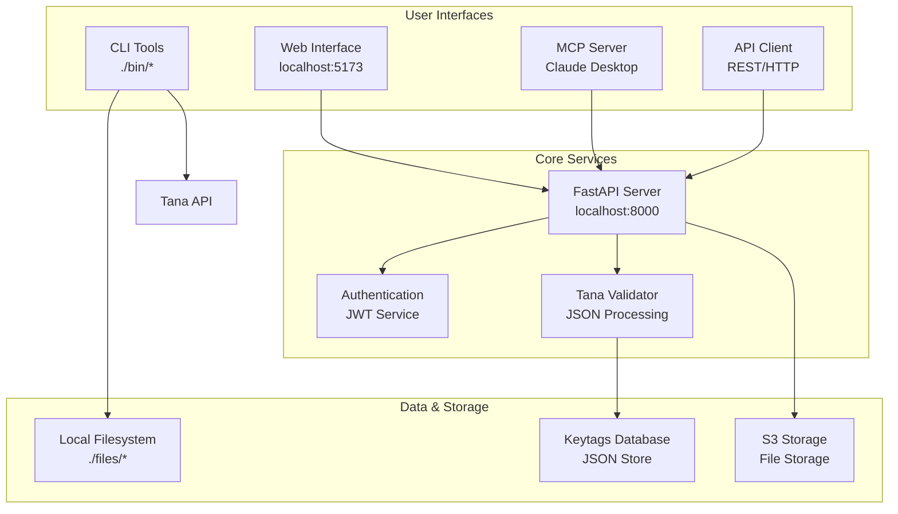

# TanaChat.ai

**AI-powered platform with MCP server, API, and web interface for Tana workspace management and analysis.**

## 🚀 Quick Start

```bash
# Clone and setup
git clone https://github.com/thomashaus/TanaChat.git
cd TanaChat
make setup

# Configure environment
cp .env.example .env.local
# Edit .env.local with your credentials

# Start development services
make dev

# Services available at:
# • Web Interface: http://localhost:5173
# • API Documentation: http://localhost:8000/docs
# • API Health: http://localhost:8000/api/health
```

## 🎯 What is TanaChat.ai?

TanaChat.ai is a comprehensive AI-powered platform for **Tana workspace management** that bridges the gap between local development and cloud-based collaboration. It provides multiple interfaces for working with Tana data:

- **CLI Tools** for power users and automation
- **REST API** for programmatic access
- **Web Interface** for casual users
- **MCP Server** for AI assistant integration

### Key Capabilities

✅ **AI Chat Interface**: Simulate conversations with your Tana workspace using a sophisticated chat UI
✅ **Command Palette**: Global `Cmd+K` navigation for power users
✅ **Knowledge Graph**: Interactive background visualization of your connected nodes
✅ **Mission Control**: Real-time health dashboard and system status
✅ **Import & Export**: Convert Tana JSON exports to organized markdown and Obsidian vaults
✅ **Selective Processing**: Choose which supertags to include via metadata management
✅ **Content Analysis**: Deep analysis of workspace structure and usage patterns
✅ **API Integration**: Post content directly to Tana nodes
✅ **User Management**: Secure authentication with user-scoped data isolation
✅ **Cloud Storage**: S3 storage integration for file persistence

## 🏗 Architecture



## 📚 Documentation

### Core Documentation
- **[Architecture](docs/architecture.md)** - System architecture and component design
- **[Design](docs/design.md)** - Design principles and patterns
- **[Development](docs/development.md)** - Development setup and workflow
- **[Testing](docs/testing.md)** - Testing strategy and guidelines
- **[Status](docs/status.md)** - Current project status and roadmap

### User Guides
- **[Tana Tools](docs/tana-tools.md)** - Complete CLI tool reference
- **[Examples](docs/examples/)** - Practical usage examples

### Reference
- **[API Reference](api/openapi.yaml)** - OpenAPI specification
- **[AsyncAPI Reference](api/asyncapi.yaml)** - Async API specification

## 🛠 Services Overview

| Service | Port | Description |
|---------|------|-------------|
| **www** | 5173 | React web interface with API integration |
| **api** | 8000 | FastAPI backend with authentication and file management |
| **mcp** | stdio | FastMCP server for Claude Desktop integration |

## 🔧 CLI Tools

Powerful command-line tools for Tana workspace management:

### Core Tools

- **[`tana-importjson`](docs/tana-tools.md#tana-importjson)** - Import Tana exports to organized markdown
- **[`tana-keytags`](docs/tana-tools.md#tana-keytags)** - Manage supertag metadata for selective exports
- **[`tana-obsidian`](docs/tana-tools.md#tana-obsidian)** - Generate Obsidian vaults from Tana exports
- **[`tana-convert`](docs/tana-tools.md#tana-convert)** - Convert markdown to Tana format
- **[`tana-find`](docs/tana-tools.md#tana-find)** - Search Tana exports by supertag/keyword
- **[`tana-analyze`](docs/tana-tools.md#tana-analyze)** - Analyze workspace structure
- **[`tana-post`](docs/tana-tools.md#tana-post)** - Post content to Tana via API

### Quick Examples

```bash
# Import Tana export to organized markdown structure
./bin/tana-importjson

# Manage which supertags to export
./bin/tana-keytags add --from-export
./bin/tana-keytags validate

# Generate Obsidian vault
./bin/tana-obsidian workspace.json

# Convert markdown for Tana
./bin/tana-convert meeting.md --supertag "Meeting"

# Find all project nodes
./bin/tana-find --export workspace.json "project"

# Post content to Tana
./bin/tana-post "Task completed" -n "INBOX"
```

## 🔄 Project Structure & Flow

### Data Flow Patterns

```
Tana Export → Validation → Processing → Storage → Interface
     ↓           ↓           ↓          ↓         ↓
 JSON File → Metadata → Analysis → Spaces/Local → Web/CLI/MCP
```

### Component Integration

1. **CLI Tools** (`./bin/`) → Direct file processing and local operations
2. **API Layer** (`./api/`) → REST endpoints with authentication and cloud storage
3. **Web Interface** (`./www/`) → User-friendly frontend for API features
4. **MCP Server** (`./mcp/`) → AI assistant integration with workspace access
5. **Shared Libraries** (`./lib/`) → Common functionality across all interfaces

### Standards & Design Principles

**Must-Have Requirements:**
- ✅ **User Privacy**: All user data isolated and secured by authentication
- ✅ **Portable Architecture**: CLI tools work without complex dependencies
- ✅ **API-First Design**: All functionality accessible via REST API
- ✅ **Tana Compatibility**: Support for Tana Intermediate Format
- ✅ **Extensibility**: Modular design allows easy feature additions

**Key Design Points:**
- 🔄 **Progressive Disclosure**: Simple interface for beginners, powerful features for experts
- 🛡️ **Security-First**: JWT authentication, input validation, user scoping
- 📊 **Rich Metadata**: Comprehensive tracking of file processing and workspace analytics
- 🔧 **Developer Experience**: Hot reload, comprehensive testing, clear documentation

## 🚀 Getting Started

### For Users

1. **Install Dependencies**: Requires Python 3.12+ and Node.js 18+
2. **Get Tana API Key**: From [Tana Settings](https://app.tana.inc/settings)
3. **Configure Environment**: Copy `.env.example` to `.env.local` and add your API key
4. **Import Your Data**: Place Tana exports in `./files/import/` and run `./bin/tana-importjson`
5. **Explore**: Use CLI tools or web interface to analyze your workspace

### For Developers

```bash
# Development setup
make setup
make dev

# Run tests
make test

# Code quality checks
make lint
make format

# Individual services
make dev-api     # API server only
make dev-www     # Web interface only
make dev-mcp     # MCP server only
```

## 🌐 API Integration

### Authentication

All API endpoints (except health checks) require JWT authentication:

```bash
# Login and get token
curl -X POST http://localhost:8000/api/auth/login \
  -H "Content-Type: application/json" \
  -d '{"username": "your_user", "password": "your_password"}'

# Use token for authenticated requests
curl -X GET http://localhost:8000/api/tana/files \
  -H "Authorization: Bearer YOUR_JWT_TOKEN"
```

### File Upload & Management

```bash
# Upload Tana file
curl -X POST http://localhost:8000/api/tana/upload \
  -H "Authorization: Bearer YOUR_JWT_TOKEN" \
  -F "file=@workspace.json"

# List files
curl -X GET http://localhost:8000/api/tana/files \
  -H "Authorization: Bearer YOUR_JWT_TOKEN"

# Get file metadata
curl -X GET http://localhost:8000/api/tana/files/{file_id}/meta \
  -H "Authorization: Bearer YOUR_JWT_TOKEN"
```

## 🧪 MCP Integration

The MCP server provides workspace access to AI assistants:

```json
{
  "mcpServers": {
    "tanachat": {
      "command": "uv",
      "args": ["--directory", "/path/to/TanaChat.ai/mcp", "run", "python", "src/main.py"],
      "env": {
        "TANA_API_KEY": "your_api_key"
      }
    }
  }
}
```

Available MCP tools:
- `tana_find`: Search workspace by content or supertag
- `tana_analyze`: Get workspace statistics and structure
- `tana_post`: Create new nodes in Tana
- `tana_export`: Process and export workspace data

## 🛠 Tech Stack

### Backend
- **Python 3.12+**: Primary language for API and tools
- **FastAPI**: Modern web framework with automatic OpenAPI docs
- **Pydantic**: Data validation and serialization
- **uv**: Fast Python package manager
- **JWT**: Stateless authentication
- **Boto3**: S3 storage integration

### Frontend
- **React 18**: User interface framework
- **TypeScript**: Type-safe JavaScript
- **TailwindCSS**: Utility-first styling
- **Vite**: Fast development and build tool

### Infrastructure
- **AWS App Platform**: Scalable hosting
- **S3 Storage**: Object storage
- **GitHub Actions**: CI/CD pipeline
- **Docker**: Containerization support

## 📄 License

MIT License - see [LICENSE](LICENSE) file for details.

## 🤝 Contributing

1. **Fork** the repository
2. **Create** a feature branch: `git checkout -b feature/amazing-feature`
3. **Commit** your changes: `git commit -m 'Add amazing feature'`
4. **Push** to the branch: `git push origin feature/amazing-feature`
5. **Open** a Pull Request

See [Development Guide](docs/development.md) for detailed contributing guidelines.

## 📞 Support & Community

- **Documentation**: See [docs/](docs/) for comprehensive guides
- **Issues**: [GitHub Issues](https://github.com/thomashaus/TanaChat/issues) for bug reports and feature requests
- **Discussions**: [GitHub Discussions](https://github.com/thomashaus/TanaChat/discussions) for questions and ideas
- **Security**: Report security issues to [security@tanachat.ai](mailto:security@tanachat.ai)

## 🤝 Contributing

We welcome contributions! Please see our [Contributing Guide](.github/CONTRIBUTING.md) for details.

### Quick Contribution Guide

1. **Fork** the repository
2. **Create** a feature branch: `git checkout -b feature/amazing-feature`
3. **Commit** your changes: `git commit -m 'Add amazing feature'`
4. **Push** to the branch: `git push origin feature/amazing-feature`
5. **Open** a Pull Request

### Issue Templates

We provide issue templates to help you:
- [🐛 Bug Report](https://github.com/thomashaus/TanaChat/issues/new?assignees=&labels=bug&template=bug_report.md)
- [🚀 Feature Request](https://github.com/thomashaus/TanaChat/issues/new?assignees=&labels=enhancement&template=feature_request.md)
- [🌴 Tana Integration](https://github.com/thomashaus/TanaChat/issues/new?assignees=&labels=tana-integration&template=tana_integration.md)
- [📚 Documentation](https://github.com/thomashaus/TanaChat/issues/new?assignees=&labels=documentation&template=documentation.md)

## 🔧 Project Status

- **Build Status**: 
- **Security**: 
- **License**: [MIT](LICENSE)
- **Version**: 
- **Stars**: 

---

**Built with ❤️ for the Tana community**
 empowering seamless workspace management across all interfaces.