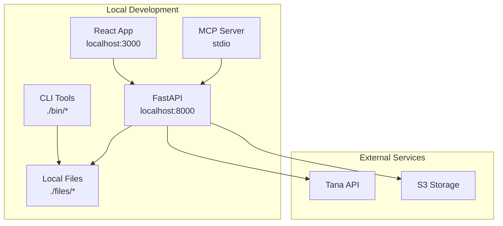

# Development Guide

## Overview

This guide covers setting up a complete development environment for the TanaChat.ai project, including all services, tools, and workflows needed for effective development.

## Prerequisites

### System Requirements

- **OS**: macOS, Linux, or Windows with WSL2
- **Python**: 3.12+ (for API and CLI tools)
- **Node.js**: 18+ (for web frontend)
- **Git**: For version control
- **Make**: For build automation
- **uv**: Python package manager (recommended)

### Required Accounts

- **Tana**: API access for workspace integration
- **AWS**: For S3 storage (optional for local development)

## Quick Start

### 1. Clone and Setup

```bash
# Clone the repository
git clone https://github.com/your-repo/TanaChat.ai
cd TanaChat.ai

# Make CLI tools executable
chmod +x bin/tana-*

# Set up development environment
make setup
```

### 2. Environment Configuration

```bash
# Copy environment template
cp .env.example .env.local

# Edit with your configuration
# Required: TANA_API_KEY
# Optional: S3_* (for cloud storage)
```

```bash
# .env.local
# Tana Integration
TANA_API_KEY=your_tana_api_key_here

# S3 Storage (optional)
S3_ACCESS_KEY=your_s3_access_key
S3_SECRET_KEY=your_s3_secret_key
S3_BUCKET=tanachat
S3_REGION=us-east-1

# Development Settings
API_SECRET_KEY=dev-secret-key-change-in-production
JWT_EXPIRY_DAYS=30
```

### 3. Start Development Services

```bash
# Start all services (www, api, mcp)
make dev

# Start individual services
make dev-www
make dev-api
make dev-mcp
```

### 4. Verify Setup

Open the following in your browser:
- **Web Interface**: http://localhost:3000
- **API Documentation**: http://localhost:8000/docs
- **API Health**: http://localhost:8000/api/health

## Development Services

### Service Architecture



### Individual Services

#### 1. CLI Tools (`./bin/`)

**Development**: No build process required, direct Python execution

```bash
# Test a CLI tool
./bin/tana-importjson --help

# Run with local files
./bin/tana-keytags list
```

#### 2. API Service (`./api/`)

**Development**: Hot reload with uvicorn

```bash
cd api
uv run uvicorn src.main:app --reload --port 8000

# Or via make
make dev-api
```

**Testing**:
```bash
cd api
uv run pytest
uv run pytest tests/unit/test_tana_service.py -v
```

#### 3. Web Interface (`./www/`)

**Development**: Vite development server with hot reload

```bash
cd www
npm run dev

# Or via make
make dev-www
```

**Building**:
```bash
cd www
npm run build
```

#### 4. MCP Server (`./mcp/`)

**Development**: Run directly for testing

```bash
cd mcp
uv run python src/main.py

# Test with Claude Desktop
make mcp-debug
```

## Development Workflow

### 1. Feature Development Workflow

```bash
# Start new feature
make feature feature-name

# Create issue (tracked automatically)
/issue create --title "Add new feature" --description "Feature details"

# Write specification
/spec create --issue ISSUE_ID

# Start implementation
/work start --issue ISSUE_ID

# Run tests frequently
make test
make lint

# Review changes
/review create --issue ISSUE_ID

# Create pull request
/pr create --issue ISSUE_ID
```

### 2. Code Development

#### Backend Development

```bash
# API development
cd api
uv add new-package
uv run pytest tests/unit/api/ -v
uv run ruff check src/
uv run ruff format src/

# CLI development
cd lib
# Edit shared libraries
cd ..
./bin/tana-toolname --test
```

#### Frontend Development

```bash
cd www
npm install new-package
npm run type-check
npm run lint
npm run test
```

### 3. Testing Strategy

```bash
# Run all tests
make test

# Specific test categories
make test-unit          # Fast unit tests
make test-integration   # Service integration tests
make test-e2e          # End-to-end tests
make test-performance  # Load and stress tests

# Test specific components
pytest tests/unit/api/test_tana_service.py -v
pytest tests/unit/lib/test_tana_importer.py -v
```

### 4. Quality Assurance

```bash
# Linting and formatting
make lint              # Run all linters
make format            # Auto-format code
make type-check        # Type checking

# Security checks
make security          # Security audit
make audit             # Dependency audit
```

## Project Structure

### Directory Layout

```
TanaChat.ai/
├── 📁 bin/                    # CLI tools
│   ├── tana-importjson        # Import processor
│   ├── tana-keytags          # Metadata manager
│   ├── tana-obsidian         # Vault generator
│   └── ...                   # Other tools
├── 📁 lib/                    # Shared Python libraries
│   ├── tana_importer.py      # Import processing
│   ├── keytags_manager.py    # Metadata management
│   ├── user_manager.py       # User authentication
│   └── colors.py             # Terminal utilities
├── 📁 api/                    # FastAPI backend
│   ├── src/
│   │   ├── routers/          # API endpoints
│   │   ├── services/         # Business logic
│   │   ├── models/           # Data models
│   │   ├── dependencies.py   # DI container
│   │   └── main.py          # Application entry
│   ├── tests/               # Test suite
│   ├── pyproject.toml       # Dependencies
│   └── openapi.yaml         # API specification
├── 📁 www/                    # React frontend
│   ├── src/                 # Source code
│   ├── public/              # Static assets
│   ├── package.json         # Dependencies
│   └── vite.config.ts       # Build config
├── 📁 mcp/                    # MCP server
│   ├── src/                 # MCP tools
│   └── pyproject.toml       # Dependencies
├── 📁 files/                  # Local file storage
│   ├── import/              # Tana exports
│   ├── export/              # Generated markdown
│   └── keytags.json         # Metadata store
├── 📁 docs/                   # Documentation
│   ├── architecture.md      # System architecture
│   ├── design.md            # Design principles
│   ├── testing.md           # Testing strategy
│   ├── development.md       # This file
│   └── status.md            # Project status
└── 📁 Makefile               # Build automation
```

### Code Organization Patterns

#### CLI Tools Pattern

```python
#!/usr/bin/env python3
"""CLI tool template"""

import sys
import argparse
from pathlib import Path

# Add lib to path for shared modules
sys.path.insert(0, str(Path(__file__).parent.parent / "lib"))

from shared_module import SharedFunction


def main():
    parser = argparse.ArgumentParser(
        description="Tool description",
        formatter_class=argparse.RawDescriptionHelpFormatter
    )

    parser.add_argument(
        "action",
        choices=["list", "add", "remove"],
        help="Action to perform"
    )

    parser.add_argument(
        "--file", "-f",
        help="Input file path"
    )

    args = parser.parse_args()

    try:
        if args.action == "list":
            result = handle_list(args)
        elif args.action == "add":
            result = handle_add(args)
        # ... handle other actions

        print(f"✅ {result}")

    except Exception as e:
        print(f"❌ Error: {e}")
        sys.exit(1)


def handle_list(args):
    """Handle list action"""
    # Implementation
    pass


if __name__ == "__main__":
    main()
```

#### API Service Pattern

```python
# api/src/services/template.py
from typing import Optional
from ..models.template import TemplateModel


class TemplateService:
    """Service template for API business logic"""

    def __init__(self, storage_client):
        self.storage = storage_client

    async def create_item(self, data: dict, user_id: str) -> TemplateModel:
        """Create new item with validation"""
        # 1. Validate input
        validated_data = TemplateModel(**data)

        # 2. Business logic
        processed_data = await self._process_data(validated_data)

        # 3. Storage
        result = await self.storage.create(processed_data, user_id)

        return result

    async def _process_data(self, data: TemplateModel) -> dict:
        """Internal processing logic"""
        # Implementation
        pass
```

## Environment Management

### Development Environments

#### Local Development

```bash
# Environment variables
export DEVELOPMENT=true
export DEBUG=true
export LOG_LEVEL=debug

# Start all services
make dev
```

#### Testing Environment

```bash
# Test configuration
export TESTING=true
export DATABASE_URL=sqlite:///test.db
export S3_ACCESS_KEY=test_key

# Run tests
make test
```

#### Production-like Environment

```bash
# Production settings
export PRODUCTION=false  # For local production testing
export LOG_LEVEL=info
export API_SECRET_KEY=$(openssl rand -hex 32)
```

### Configuration Management

```python
# api/src/config.py
from pydantic_settings import BaseSettings


class Settings(BaseSettings):
    # Environment-specific settings
    environment: str = "development"
    debug: bool = False

    # API settings
    api_host: str = "0.0.0.0"
    api_port: int = 8000

    # External services
    tana_api_key: str = ""
    do_spaces_key: str = ""

    class Config:
        env_file = ".env.local"
        env_file_encoding = "utf-8"


settings = Settings()
```

## Debugging

### API Debugging

```bash
# Start API with debugging
cd api
uv run uvicorn src.main:app --reload --log-level debug

# Use Python debugger
uv run python -m pdb -c continue src/main.py

# Test specific endpoints
uv run pytest tests/integration/api/test_upload.py -v -s
```

### CLI Debugging

```bash
# Enable debug output
DEBUG=1 ./bin/tana-importjson

# Use Python debugger
python3 -m pdb bin/tana-importjson

# Trace execution
python3 -m trace --trace bin/tana-importjson
```

### Frontend Debugging

```bash
# Start with debugging
cd www
npm run dev

# Browser debugging
# Open Chrome DevTools, go to Sources, set breakpoints
```

## Common Development Tasks

### Adding New CLI Tool

1. **Create tool file**:
```bash
touch bin/tana-newtool
chmod +x bin/tana-newtool
```

2. **Implement tool**:
```python
#!/usr/bin/env python3
import sys
from pathlib import Path

sys.path.insert(0, str(Path(__file__).parent.parent / "lib"))

def main():
    # Tool implementation
    pass

if __name__ == "__main__":
    main()
```

3. **Add tests**:
```bash
mkdir -p tests/unit/cli
touch tests/unit/cli/test_newtool.py
```

### Adding New API Endpoint

1. **Create model**:
```python
# api/src/models/newfeature.py
from pydantic import BaseModel

class NewFeatureModel(BaseModel):
    name: str
    description: str
```

2. **Add service**:
```python
# api/src/services/newfeature.py
class NewFeatureService:
    async def create_feature(self, data: NewFeatureModel) -> dict:
        # Implementation
        pass
```

3. **Add router**:
```python
# api/src/routers/newfeature.py
from fastapi import APIRouter, Depends

router = APIRouter()

@router.post("/features")
async def create_feature(
    data: NewFeatureModel,
    service: NewFeatureService = Depends(get_newfeature_service)
):
    return await service.create_feature(data)
```

4. **Update main app**:
```python
# api/src/main.py
from .routers import newfeature

app.include_router(newfeature.router, prefix="/api/newfeature", tags=["NewFeature"])
```

## Troubleshooting

### Common Issues

#### API Won't Start

```bash
# Check dependencies
cd api
uv sync

# Check port conflicts
lsof -i :8000

# Check logs
uv run uvicorn src.main:app --log-level debug
```

#### CLI Tool Errors

```bash
# Check Python path
which python3
python3 --version

# Check library imports
python3 -c "import sys; print(sys.path)"

# Check tool permissions
ls -la bin/tana-*
```

#### Frontend Build Issues

```bash
# Clear dependencies
cd www
rm -rf node_modules package-lock.json
npm install

# Check Node version
node --version
npm --version
```

### Performance Issues

```bash
# Profile Python code
uv run python -m cProfile bin/tana-importjson

# Profile API endpoints
uv run pytest tests/performance/ -v

# Monitor resource usage
htop
iotop
```

## Contributing

### Code Standards

1. **Python**: Follow PEP 8, use type hints
2. **TypeScript**: Strict typing, ESLint rules
3. **Documentation**: Comprehensive docstrings
4. **Testing**: Minimum 80% coverage
5. **Commits**: Conventional commit messages

### Pull Request Process

1. **Create feature branch**: `git checkout -b feature/name`
2. **Write tests**: Ensure coverage
3. **Update docs**: Include new features
4. **Run quality checks**: `make lint && make test`
5. **Submit PR**: With description and testing instructions

### Review Guidelines

- **Functionality**: Does it work as intended?
- **Testing**: Are tests comprehensive?
- **Documentation**: Is it well-documented?
- **Performance**: Is it efficient?
- **Security**: Are there security implications?

This development guide provides everything needed to set up, develop, test, and contribute to the TanaChat.ai project effectively.