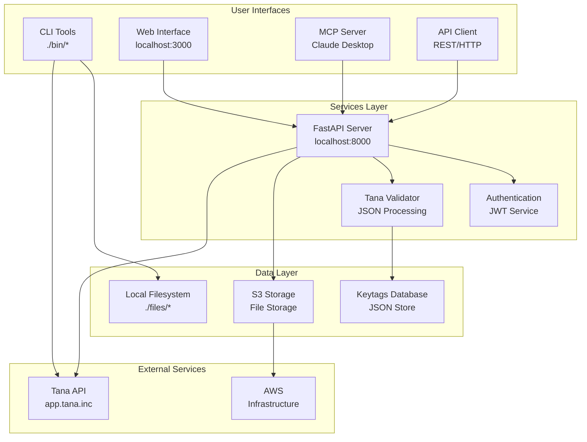
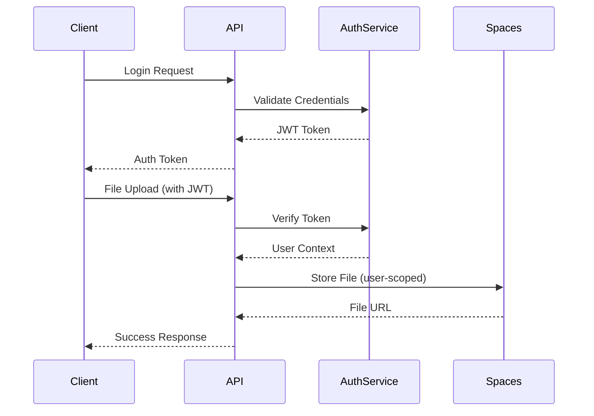

# Architecture Overview

## System Architecture

The TanaChat.ai project implements a distributed system for Tana workspace management with multiple interconnected services.



## Service Architecture

### 1. CLI Tools Layer (`./bin/`)

**Purpose**: Direct command-line access to Tana workspace management

**Components**:
- `tana-importjson`: Converts Tana exports to markdown
- `tana-keytags`: Manages supertag metadata
- `tana-convert`: Format conversion utilities
- `tana-find`: Search and analysis tools
- `tana-post`: Content posting to Tana
- `tana-obsidian`: Obsidian vault generation

**Data Flow**:
```
Tana Export → CLI Tools → Local Files → Tana API
     ↓           ↓           ↓          ↓
 JSON Files → Validation → Markdown → Content
```

### 2. API Service Layer (`./api/`)

**Purpose**: RESTful API for web and programmatic access

**Components**:
- **FastAPI Application**: Main API server
- **Authentication Service**: JWT token management
- **Tana Validator**: File validation and processing
- **Spaces Client**: DigitalOcean storage integration

**Endpoints**:
- `/api/auth/*`: Authentication and user management
- `/api/tana/*`: File upload, validation, and management
- `/api/spaces/*`: Storage connectivity and management
- `/docs`: OpenAPI documentation

### 3. Web Interface Layer (`./www/`)

**Purpose**: User-friendly web interface for Tana management

**Components**:
- React SPA with TypeScript
- TailwindCSS styling
- Vite development server
- API integration

### 4. MCP Server Layer (`./mcp/`)

**Purpose**: Model Context Protocol server for AI assistant integration

**Components**:
- FastMCP server implementation
- Tools for workspace analysis
- Content management capabilities
- Real-time data access

## Data Architecture

### File Organization

```
TanaChat.ai/
├── files/
│   ├── import/           # Tana exports for processing
│   ├── export/           # Generated markdown exports
│   └── keytags.json      # Supertag metadata
├── lib/                  # Shared Python libraries
├── bin/                  # CLI tools
├── api/                  # FastAPI backend
├── www/                  # React frontend
├── mcp/                  # MCP server
└── docs/                 # Documentation
```

### Data Flow Patterns

1. **Import Flow**:
   ```
   Tana Export → Validation → Processing → Markdown Export
        ↓              ↓           ↓           ↓
   JSON File → Metadata → Analysis → File System
   ```

2. **API Flow**:
   ```
   Client Request → Authentication → Validation → Storage
        ↓               ↓              ↓          ↓
   JWT Token → User Context → File Processing → DO Spaces
   ```

3. **MCP Flow**:
   ```
   AI Assistant → MCP Server → API → Local Files
        ↓               ↓          ↓         ↓
   Tool Calls → Validation → Analysis → Results
   ```

## Security Architecture

### Authentication Flow



### Security Features

- **JWT Authentication**: Stateless token-based auth
- **User Scoping**: All operations isolated by user
- **Input Validation**: Comprehensive file and data validation
- **Rate Limiting**: File size and request limits
- **CORS Protection**: Configurable cross-origin policies

## Infrastructure Architecture

### DigitalOcean Deployment

```
DigitalOcean Infrastructure
├── App Platform #1: www (React SPA)
├── App Platform #2: api (FastAPI)
├── App Platform #3: mcp (FastMCP)
└── Spaces: tanachat (File Storage)
```

### Local Development

```
Development Environment
├── www: localhost:3000 (Vite Dev Server)
├── api: localhost:8000 (Uvicorn)
├── mcp: stdio (FastMCP)
└── Shared: ./files/ (Local Storage)
```

## Integration Patterns

### Tana API Integration

- **Authentication**: API key management
- **Content Posting**: Node creation and updates
- **Workspace Export**: JSON export retrieval
- **Real-time Sync**: Webhook processing

### Storage Integration

- **Local Files**: Immediate access for CLI tools
- **DO Spaces**: Persistent storage for API uploads
- **Metadata**: JSON-based configuration tracking
- **Backup**: Automated backup systems

## Technology Stack

### Backend Technologies

- **Python 3.12+**: Primary language for API and tools
- **FastAPI**: Modern web framework for API
- **Pydantic**: Data validation and serialization
- **JWT**: Authentication tokens
- **Boto3**: AWS S3/DigitalOcean Spaces client
- **Uvicorn**: ASGI server

### Frontend Technologies

- **React 18**: User interface framework
- **TypeScript**: Type-safe JavaScript
- **TailwindCSS**: Utility-first styling
- **Vite**: Fast development build tool

### DevOps Technologies

- **Docker**: Containerization
- **GitHub Actions**: CI/CD pipeline
- **DigitalOcean**: Cloud infrastructure
- **Make**: Build automation

## Performance Considerations

### Scalability

- **Stateless API**: Horizontal scaling capability
- **CDN Integration**: Static asset delivery
- **Caching**: Response caching where appropriate
- **Async Processing**: Background task handling

### Reliability

- **Health Checks**: Service monitoring
- **Error Handling**: Comprehensive error management
- **Retry Logic**: Resilient external API calls
- **Logging**: Structured logging for debugging

### Optimization

- **File Streaming**: Large file processing
- **Compression**: Response compression
- **Connection Pooling**: Database/API efficiency
- **Lazy Loading**: On-demand resource loading

## Development Architecture

### Code Organization

```
Project Structure
├── lib/                 # Shared utilities
│   ├── tana_importer.py
│   ├── keytags_manager.py
│   └── user_manager.py
├── bin/                 # CLI applications
├── api/src/             # API source code
│   ├── routers/         # API endpoints
│   ├── services/        # Business logic
│   ├── models/          # Data models
│   └── dependencies.py  # DI container
├── www/src/             # Frontend source
└── mcp/src/             # MCP server
```

### Development Workflow

1. **Local Development**: Hot reload across services
2. **Testing**: Unit and integration tests
3. **Documentation**: Auto-generated API docs
4. **Deployment**: Git-based deployments

## Monitoring and Observability

### Health Monitoring

- **Service Health**: Endpoint health checks
- **Resource Usage**: CPU, memory, storage metrics
- **Error Tracking**: Structured error logging
- **Performance Metrics**: Request timing analysis

### Logging Strategy

- **Structured Logging**: JSON-formatted logs
- **Log Levels**: Debug, info, warning, error
- **Correlation IDs**: Request tracking
- **Security Events**: Authentication and authorization logs

This architecture provides a comprehensive foundation for scalable Tana workspace management with clear separation of concerns and robust integration patterns.