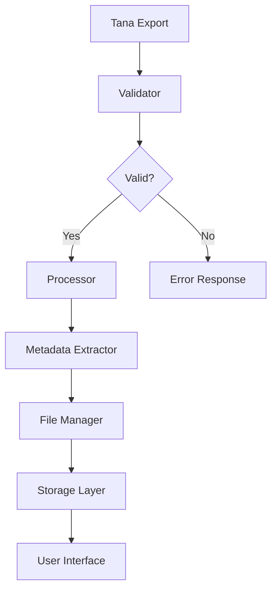
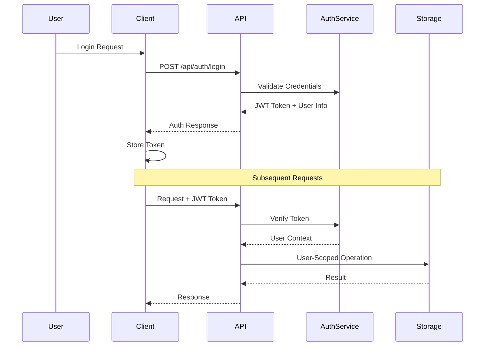

# Design Documentation

## Design Principles

### Core Principles

1. **Simplicity First**: Tools should be intuitive and easy to use
2. **Portable Architecture**: CLI tools work without complex dependencies
3. **API-First Design**: All functionality accessible via REST API
4. **User Privacy**: User data isolated and secured
5. **Extensibility**: Modular design allows easy feature additions

### Design Standards

#### Code Standards

- **Python**: PEP 8 compliance, type hints, docstrings
- **TypeScript**: Strict typing, ESLint + Prettier
- **Documentation**: Comprehensive inline and external docs
- **Testing**: Minimum 80% code coverage
- **Error Handling**: Graceful degradation with clear messages

#### API Standards

- **REST Principles**: Proper HTTP methods and status codes
- **OpenAPI 3.0**: Complete API documentation
- **Versioning**: Semantic versioning for breaking changes
- **Authentication**: JWT-based stateless authentication
- **Rate Limiting**: Fair usage policies

#### Data Standards

- **JSON Schema**: Structured data validation
- **Tana Compatibility**: Support for Tana Intermediate Format
- **Metadata Tracking**: Comprehensive file and process metadata
- **User Scoping**: All user data isolated by user ID

## System Design

### Data Flow Design



### Component Design

#### 1. CLI Tools Design

**Design Goals**:
- Zero dependencies beyond Python standard library
- Progressive disclosure of features
- Consistent command interface
- Comprehensive help system

**Command Pattern**:
```bash
./bin/tana-<tool> <action> [options] [arguments]

Examples:
./bin/tana-importjson --export workspace.json --output ./files/export
./bin/tana-keytags add --supertag "Project" --validate
./bin/tana-find --export workspace.json --supertag "Meeting"
```

**Error Handling**:
```python
try:
    result = process_file(file_path)
except ValidationError as e:
    print(f"❌ Validation failed: {e}")
    sys.exit(1)
except ProcessingError as e:
    print(f"⚠️  Processing warning: {e}")
    # Continue with partial results
```

#### 2. API Service Design

**Layer Architecture**:
```
┌─────────────────┐
│   Controllers   │ ← HTTP Request Handling
├─────────────────┤
│    Services     │ ← Business Logic
├─────────────────┤
│   Repositories  │ ← Data Access
├─────────────────┤
│   Storage       │ ← File/Persistence
└─────────────────┘
```

**Service Pattern**:
```python
class TanaService:
    def __init__(self, storage_client: StorageClient):
        self.storage = storage_client

    async def process_upload(self, file: UploadFile, user: User) -> Result:
        # 1. Validate file
        validation = await self.validate_file(file)
        if not validation.valid:
            raise ValidationError(validation.error)

        # 2. Extract metadata
        metadata = await self.extract_metadata(file)

        # 3. Store file
        location = await self.storage.store_file(file, user.id)

        # 4. Return result
        return Result(location=location, metadata=metadata)
```

#### 3. Data Model Design

**Core Entities**:

```python
# User Management
class User:
    id: str
    username: str
    email: str
    created_at: datetime
    preferences: Dict[str, Any]

# File Management
class TanaFile:
    id: str
    user_id: str
    filename: str
    file_size: int
    upload_date: datetime
    metadata: TanaMetadata
    storage_path: str

# Metadata Model
class TanaMetadata:
    total_nodes: int
    supertags: List[SupertagInfo]
    date_range: Tuple[datetime, datetime]
    validation_result: ValidationResult
```

### Security Design

#### Authentication Design



#### Authorization Model

```python
# Permission Matrix
PERMISSIONS = {
    'owner': ['read', 'write', 'delete', 'share'],
    'collaborator': ['read', 'write'],
    'viewer': ['read']
}

# Resource Scoping
class Resource:
    def __init__(self, resource_id: str, owner_id: str):
        self.id = resource_id
        self.owner_id = owner_id

    def can_access(self, user: User, permission: str) -> bool:
        if self.owner_id == user.id:
            return permission in PERMISSIONS['owner']
        # Add collaboration logic here
        return False
```

### Performance Design

#### Caching Strategy

```python
# Multi-level Caching
class CacheManager:
    def __init__(self):
        self.memory_cache = {}  # L1: In-memory
        self.redis_cache = {}   # L2: Redis

    async def get(self, key: str) -> Any:
        # Check L1 first
        if key in self.memory_cache:
            return self.memory_cache[key]

        # Check L2
        value = await self.redis_cache.get(key)
        if value:
            self.memory_cache[key] = value
            return value

        return None
```

#### Async Processing

```python
# Background Task Processing
class TaskProcessor:
    async def process_file_upload(self, file_id: str, user_id: str):
        # Heavy processing moved to background
        async with asyncio.TaskGroup() as tg:
            tg.create_task(self.validate_file(file_id))
            tg.create_task(self.extract_metadata(file_id))
            tg.create_task(self.generate_thumbnails(file_id))

        # Notify completion
        await self.notify_user(user_id, "Processing complete")
```

### Error Handling Design

#### Error Taxonomy

```python
class TanaChatError(Exception):
    """Base exception for all custom errors"""
    def __init__(self, message: str, code: str = None):
        super().__init__(message)
        self.code = code
        self.timestamp = datetime.utcnow()

class ValidationError(TanaChatError):
    """File validation failures"""
    pass

class AuthenticationError(TanaChatError):
    """Authentication/authorization failures"""
    pass

class StorageError(TanaChatError):
    """File storage operations failures"""
    pass
```

#### Error Response Format

```python
# Standardized Error Response
{
    "error": {
        "code": "VALIDATION_FAILED",
        "message": "Invalid Tana file format",
        "details": {
            "field": "version",
            "expected": "TanaIntermediateFile V0.1",
            "actual": "Unknown format"
        },
        "timestamp": "2025-12-04T22:50:00Z",
        "request_id": "req_123456"
    }
}
```

## Database Design

### Schema Design

```sql
-- Users Table
CREATE TABLE users (
    id UUID PRIMARY KEY DEFAULT gen_random_uuid(),
    username VARCHAR(50) UNIQUE NOT NULL,
    email VARCHAR(255) UNIQUE NOT NULL,
    password_hash VARCHAR(255) NOT NULL,
    created_at TIMESTAMP WITH TIME ZONE DEFAULT NOW(),
    updated_at TIMESTAMP WITH TIME ZONE DEFAULT NOW(),
    preferences JSONB DEFAULT '{}'
);

-- Files Table
CREATE TABLE tana_files (
    id UUID PRIMARY KEY DEFAULT gen_random_uuid(),
    user_id UUID REFERENCES users(id) ON DELETE CASCADE,
    filename VARCHAR(255) NOT NULL,
    file_size BIGINT NOT NULL,
    storage_path VARCHAR(500) NOT NULL,
    upload_date TIMESTAMP WITH TIME ZONE DEFAULT NOW(),
    metadata JSONB NOT NULL,
    file_hash VARCHAR(64) UNIQUE NOT NULL
);

-- Metadata Indexes
CREATE INDEX idx_files_user_id ON tana_files(user_id);
CREATE INDEX idx_files_upload_date ON tana_files(upload_date);
CREATE INDEX idx_files_metadata ON tana_files USING GIN(metadata);
```

## API Design Specification

### Endpoint Design

#### Authentication Endpoints

```yaml
/api/auth/login:
  post:
    summary: Authenticate user
    requestBody:
      required: true
      content:
        application/json:
          schema:
            type: object
            properties:
              username:
                type: string
              password:
                type: string
    responses:
      200:
        description: Authentication successful
        content:
          application/json:
            schema:
              type: object
              properties:
                access_token:
                  type: string
                token_type:
                  type: string
                  example: bearer
                expires_in:
                  type: integer
```

#### File Management Endpoints

```yaml
/api/tana/upload:
  post:
    summary: Upload Tana file
    security:
      - bearerAuth: []
    requestBody:
      required: true
      content:
        multipart/form-data:
          schema:
            type: object
            properties:
              file:
                type: string
                format: binary
    responses:
      200:
        description: File uploaded successfully
        content:
          application/json:
            schema:
              $ref: '#/components/schemas/TanaImportMetadata'
```

### Response Design

#### Success Responses

```python
# Standard Success Response
{
    "success": true,
    "data": {
        # Response-specific data
    },
    "metadata": {
        "timestamp": "2025-12-04T22:50:00Z",
        "request_id": "req_123456",
        "version": "0.1.0"
    }
}
```

#### Pagination

```python
# Paginated Response
{
    "success": true,
    "data": {
        "items": [...],
        "pagination": {
            "page": 1,
            "per_page": 20,
            "total_items": 150,
            "total_pages": 8,
            "has_next": true,
            "has_prev": false
        }
    }
}
```

## Integration Design

### Tana API Integration

```python
class TanaAPIClient:
    def __init__(self, api_key: str):
        self.api_key = api_key
        self.base_url = "https://api.tana.inc"

    async def create_node(self, content: str, supertags: List[str]) -> dict:
        """Create a new node in Tana"""
        payload = {
            "content": content,
            "supertags": supertags
        }
        async with httpx.AsyncClient() as client:
            response = await client.post(
                f"{self.base_url}/nodes",
                json=payload,
                headers={"Authorization": f"Bearer {self.api_key}"}
            )
            response.raise_for_status()
            return response.json()
```

### Storage Integration

```python
class StorageManager:
    def __init__(self, provider: str = "digitalocean"):
        self.provider = provider
        self.client = self._get_client()

    def _get_client(self):
        if self.provider == "digitalocean":
            return SpacesClient()
        elif self.provider == "aws":
            return S3Client()
        else:
            return LocalFileClient()

    async def store_file(self, file_data: bytes, key: str) -> str:
        """Store file and return URL"""
        result = await self.client.upload(key, file_data)
        return result["url"]
```

## Testing Design

### Test Strategy

```python
# Unit Test Example
class TestTanaValidator:
    def test_valid_tana_file(self):
        validator = TanaValidator()
        valid_file = load_test_file("valid_tana.json")
        result = validator.validate(valid_file)

        assert result.valid is True
        assert result.node_count > 0
        assert "project" in result.supertags

    def test_invalid_tana_file(self):
        validator = TanaValidator()
        invalid_file = {"invalid": "structure"}
        result = validator.validate(invalid_file)

        assert result.valid is False
        assert result.error is not None

# Integration Test Example
async def test_file_upload_flow():
    # Setup test client
    async with AsyncClient(app=app, base_url="http://test") as client:
        # Login
        login_response = await client.post("/api/auth/login", json={
            "username": "testuser",
            "password": "testpass"
        })
        token = login_response.json()["access_token"]

        # Upload file
        with open("test_file.json", "rb") as f:
            upload_response = await client.post(
                "/api/tana/upload",
                files={"file": ("test.json", f, "application/json")},
                headers={"Authorization": f"Bearer {token}"}
            )

        assert upload_response.status_code == 200
        metadata = upload_response.json()
        assert metadata["file_id"] is not None
```

This design documentation provides comprehensive guidelines for understanding and extending the TanaChat.ai system architecture and implementation patterns.