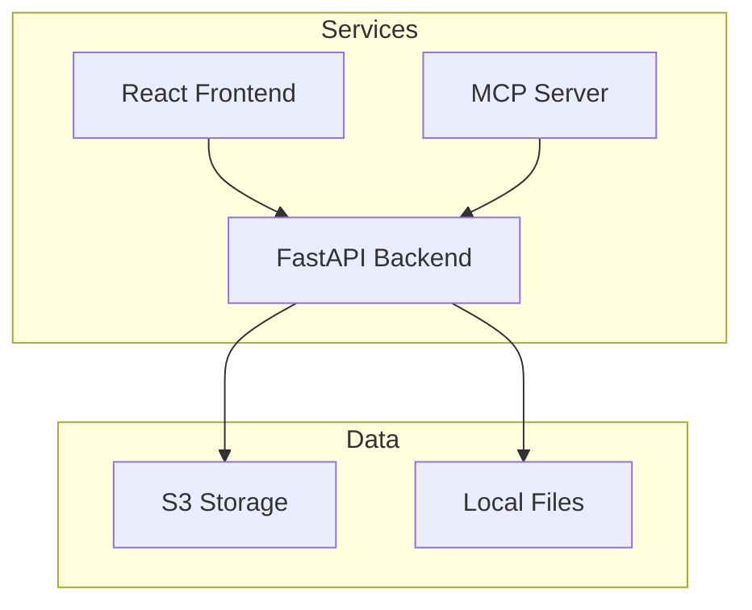

# Architecture & Design

This document details the system architecture, design principles, and data flow of TanaChat.

## Design Principles

1. **Simplicity First**: Tools should be intuitive and easy to use.
2. **Portable Architecture**: CLI tools work without complex dependencies.
3. **API-First Design**: All functionality accessible via REST API.
4. **User Privacy**: User data isolated and secured.
5. **Extensibility**: Modular design allows easy feature additions.

### Service Architecture

The system consists of three main decoupled services:



1. **Frontend (`/www`)**: React 18 SPA + Vite + Tailwind.
2. **Backend (`/api`)**: FastAPI + Pydantic + JWT Auth. Handles business logic and Tana integration.
3. **MCP Server (`/mcp`)**: FastMCP server providing AI tools for Claude/Cursor.
4. **CLI Tools (`/bin`)**: Direct Python scripts for power users.

## Data Flow

### 1. File Import
```
Tana Export (JSON) -> Validator -> Metadata Extraction -> Markdown Generation
```

### 2. API Operations
```
Request -> Auth (JWT) -> Validation -> Processing -> Storage (S3/Local)
```

### 3. MCP Integration
```
User Prompt -> LLM -> MCP Tool Call -> API Layer -> Tana/Storage
```

## Security Design

- **Authentication**: Stateless JWT mechanism.
- **Authorization**: User-scoped resource access.
- **Storage**: User-specific paths in S3 buckets (`user_id/files/...`).
- **Secrets**: Managed via environment variables (see [Configuration](configuration.md)).

## Database Schema

**Users**
- `id`: UUID
- `username`: String
- `email`: String
- `preferences`: JSON

**Files**
- `id`: UUID
- `user_id`: UUID (Ref User)
- `metadata`: JSON (Supertags, Stats)
- `storage_path`: String

## Code Organization

```
TanaChat/
├── api/          # Backend Service
├── bin/          # CLI Tools
├── docs/         # Documentation (You are here)
├── lib/          # Shared Code
├── mcp/          # MCP Server Service
├── www/          # Frontend Service
└── files/        # Local storage (ignored)
```
