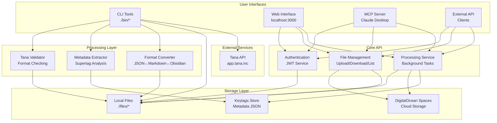

# Project Structure & Data Flow

## 🔄 Complete Data Flow Overview

The TanaChat.ai project implements a multi-layered architecture that connects various interfaces to Tana workspace data. Here's how data flows through the system:



## 📊 Detailed Component Interactions

### 1. CLI Tools Processing Flow

```
Tana Export → Validation → Metadata Extraction → Format Conversion → File Output
     ↓              ↓                ↓                   ↓           ↓
JSON File → Tana Validator → Supertag Analyzer → Markdown/ Obsidian → ./files/export/
```

**Key Scripts:**
- **tana-importjson**: Main import processor
- **tana-keytags**: Manages metadata for selective processing
- **tana-obsidian**: Creates Obsidian vaults
- **tana-find**: Searches processed data

**File Operations:**
```bash
# Standard workflow
./bin/tana-importjson                    # Import from ./files/import/
./bin/tana-keytags add --from-export       # Extract metadata
./bin/tana-obsidian workspace.json       # Generate Obsidian vault
./bin/tana-find --project                  # Search processed data
```

### 2. API Service Flow

```
Client Request → Authentication → Authorization → Processing → Storage → Response
       ↓              ↓              ↓           ↓         ↓          ↓
HTTP Request → JWT Token → User Context → File Op → Spaces/Local → JSON/HTML
```

**API Endpoints:**
- **Authentication**: `/api/auth/*`
- **File Management**: `/api/tana/*`
- **Storage Status**: `/api/spaces/*`

**Request Flow:**
```bash
# Complete API workflow
curl -X POST http://localhost:8000/api/auth/login -d '{"username":"user","password":"pass"}'
# → JWT Token

curl -X POST http://localhost:8000/api/tana/upload -H "Authorization: Bearer TOKEN" -F "file=@workspace.json"
# → File validation + storage + metadata extraction

curl -X GET http://localhost:8000/api/tana/files -H "Authorization: Bearer TOKEN"
# → File list with metadata
```

### 3. MCP Server Integration Flow

```
AI Assistant → MCP Server → API Layer → Storage → Tana API → Response
     ↓             ↓           ↓         ↓         ↓         ↓
Tool Call → FastMCP Tool → REST API → File Op → Workspace → Data
```

**MCP Tools Available:**
- `tana_find`: Search workspace
- `tana_analyze`: Get statistics
- `tana_post`: Create content
- `tana_export`: Process exports

**Integration Example:**
```json
{
  "mcpServers": {
    "tanachat": {
      "command": "uv",
      "args": ["--directory", "/path/to/mcp", "run", "python", "src/main.py"],
      "env": {"TANA_API_KEY": "your_key"}
    }
  }
}
```

### 4. Web Interface Flow

```
User Interface → React App → API Client → API Layer → Storage → Display
       ↓              ↓           ↓         ↓         ↓         ↓
Browser UI → SPA Routes → HTTP Client → REST API → File Ops → File List/Metadata
```

**Web Application Structure:**
- **Authentication**: Login/logout flows
- **File Management**: Upload, list, download interfaces
- **Processing Dashboard**: Track background operations
- **Analytics**: Workspace statistics and insights

## 🗂️ File Organization Patterns

### Directory Structure

```
TanaChat.ai/
├── 📁 bin/                    # CLI Tools (User Interface)
│   ├── tana-importjson        # Import processor
│   ├── tana-keytags          # Metadata manager
│   ├── tana-obsidian         # Obsidian generator
│   ├── tana-find             # Search tool
│   ├── tana-analyze          # Analysis tool
│   └── tana-post             # Tana API client
├── 📁 lib/                    # Shared Libraries
│   ├── tana_importer.py      # Import processing logic
│   ├── keytags_manager.py    # Metadata management
│   ├── user_manager.py       # User authentication
│   └── tana_poster.py        # Tana API integration
├── 📁 api/                    # REST API (Backend Service)
│   ├── src/
│   │   ├── routers/          # API endpoints
│   │   ├── services/         # Business logic
│   │   ├── models/           # Data models
│   │   └── main.py          # FastAPI application
│   └── openapi.yaml         # API specification
├── 📁 www/                    # Web Interface (Frontend)
│   ├── src/
│   │   ├── components/       # React components
│   │   ├── pages/           # Page components
│   │   ├── hooks/           # Custom hooks
│   │   └── services/        # API client
├── 📁 mcp/                    # MCP Server (AI Integration)
│   ├── src/
│   │   ├── tools/           # MCP tool implementations
│   │   └── main.py          # FastMCP server
├── 📁 files/                  # Local Storage
│   ├── import/              # Tana exports for processing
│   ├── export/              # Generated markdown/files
│   ├── users/               # User-specific data
│   ├── metadata/            # User and metadata files
│   └── keytags.json         # Global metadata store
└── 📁 docs/                  # Documentation
```

### Data Flow by Interface

#### CLI Tools → Local Files
```
./files/import/     →  Tana exports (user input)
./files/export/     →  Processed markdown/obsidian
./files/users/      →  User-specific storage
./files/metadata/   →  Authentication and tracking
```

#### API → Cloud + Local Storage
```
User Upload → Validation → Spaces Storage → Metadata
File List → Spaces API → User Files → Processing
Download → Spaces Retrieval → File Content → API Response
```

#### MCP → API → Storage
```
AI Request → MCP Tool → API Call → Storage → Response
Tool calls map 1:1 to API endpoints with additional AI-friendly formatting
```

## 🔧 Integration Points

### Standards & Interfaces

**1. Tana Integration Standards**
- **Format**: Tana Intermediate Format V0.1
- **API**: Tana REST API with API key authentication
- **Export**: JSON exports with full workspace data
- **Post**: Direct node creation and updates

**2. File Format Standards**
- **Input**: Tana JSON exports (Tana Intermediate Format)
- **Output**: Markdown with YAML frontmatter
- **Metadata**: JSON with structured supertag information
- **Obsidian**: Markdown with wiki links and folder organization

**3. API Standards**
- **Authentication**: JWT Bearer tokens
- **Format**: REST with OpenAPI 3.0 specification
- **Responses**: JSON with consistent error handling
- **Async**: AsyncAPI specification for WebSocket events

### Key Integration Patterns

**1. Progressive Interface Usage**
```bash
# Beginner: CLI tools for personal use
./bin/tana-importjson

# Intermediate: API for automation
curl -X POST http://localhost:8000/api/tana/upload

# Advanced: MCP for AI integration
# Configure in Claude Desktop
```

**2. User Data Flow**
```
Tana Export → TanaChat.ai → Multiple Interfaces → Processed Data
     ↓              ↓                ↓                ↓
Personal JSON → CLI/API/MCP → Markdown/JSON → Various Formats
```

**3. Metadata-Driven Processing**
```json
{
  "supertags": {
    "Project": {"enabled": true, "count": 15},
    "Task": {"enabled": true, "count": 42},
    "Meeting": {"enabled": false, "count": 8}
  }
}
```

## 🎯 User Journey Examples

### 1. New User Onboarding

```
1. Get Tana API Key → 2. Setup TanaChat.ai → 3. Export from Tana → 4. Import & Process → 5. Explore Data
```

**CLI Workflow:**
```bash
# 1. Setup
git clone TanaChat.ai
cd TanaChat.ai
make setup
./bin/tana-createuser --username myuser --email my@email.com

# 2. Configure
cp .env.example .env.local
# Add TANA_API_KEY

# 3. Export from Tana (manual step)
# Download workspace.json

# 4. Process
cp workspace.json ./files/import/
./bin/tana-importjson
./bin/tana-keytags add --from-export

# 5. Explore
ls ./files/export/
./bin/tana-find --project
```

### 2. Developer Integration

```
1. Get API Token → 2. Build Client → 3. Upload Files → 4. Process Data → 5. Retrieve Results
```

**API Workflow:**
```bash
# 1. Authenticate
TOKEN=$(curl -s -X POST http://localhost:8000/api/auth/login \
  -d '{"username":"dev","password":"pass"}' | jq -r .access_token)

# 2. Upload
curl -X POST http://localhost:8000/api/tana/upload \
  -H "Authorization: Bearer $TOKEN" \
  -F "file=@workspace.json"

# 3. List files
curl -X GET http://localhost:8000/api/tana/files \
  -H "Authorization: Bearer $TOKEN"

# 4. Get metadata
FILE_ID="file-123"
curl -X GET "http://localhost:8000/api/tana/files/$FILE_ID/meta" \
  -H "Authorization: Bearer $TOKEN"
```

### 3. AI Assistant Integration

```
1. Configure MCP → 2. AI asks question → 3. MCP processes → 4. Returns structured data
```

**MCP Workflow:**
```json
// Claude Desktop config.json
{
  "mcpServers": {
    "tanachat": {
      "command": "uv",
      "args": ["--directory", "/path/to/TanaChat.ai/mcp", "run", "python", "src/main.py"],
      "env": {
        "TANA_API_KEY": "your_api_key",
        "TANACHAT_API_URL": "http://localhost:8000",
        "TANACHAT_TOKEN": "your_jwt_token"
      }
    }
  }
```

## 🔄 Error Handling & Recovery

### Error Flow Patterns

**1. CLI Error Handling**
```
CLI Tool → Error Detection → User Message → Suggestion → Exit/Continue
```

**2. API Error Handling**
```
API Request → Validation → Processing → Storage → Response
     ↓            ↓           ↓         ↓         ↓
HTTP 400 → JSON Error → Client Retry → User Alert → Graceful Degradation
```

**3. MCP Error Handling**
```
AI Request → MCP Tool → API Call → Response → Error Handling → AI Feedback
```

### Recovery Strategies

**File Processing Recovery:**
- Partial processing with warnings
- Automatic retry for transient errors
- Rollback on critical failures
- Detailed error reporting

**API Recovery:**
- Connection pooling and retry logic
- Circuit breaker pattern for external APIs
- Graceful degradation when services unavailable
- Comprehensive logging for debugging

## 📈 Scaling Patterns

### Horizontal Scaling

**CLI Tools:** Scale by running multiple instances
```bash
# Parallel processing of multiple files
for file in *.json; do
  ./bin/tana-importjson --export "$file" &
done
wait
```

**API:** Scale with load balancers and multiple instances
```yaml
# DigitalOcean App Platform scaling
services:
  - name: api
    instance_count: 3
    instance_size: professional-s
```

**MCP:** Scale with multiple AI assistant connections
- Stateless MCP server design
- Connection pooling
- Rate limiting per client

### Vertical Scaling

**Performance Optimizations:**
- Async file processing
- Streaming for large files
- Caching of frequently accessed data
- Database optimization for metadata

## 🔮 Future Integration Points

### Planned Interfaces

1. **Mobile App**: React Native app with API integration
2. **Desktop App**: Electron app with local processing
3. **Browser Extension**: Direct Tana integration in browser
4. **Slack Bot**: Workspace management via Slack

### Integration Standards

**All future integrations must:**
- Use the same authentication system
- Follow the file format standards
- Implement proper error handling
- Support the metadata-driven processing model
- Maintain user data isolation

This comprehensive flow documentation shows how TanaChat.ai connects all interfaces through a consistent, scalable architecture that prioritizes user privacy, data integrity, and flexibility across multiple use cases.